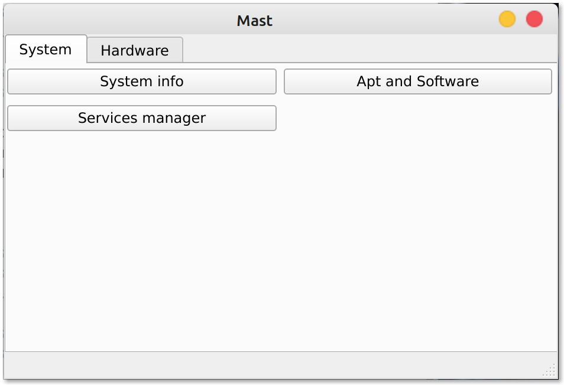

# Mast
## _Mint Additional Setup Tool_

[](https://github.com/tterb/atomic-design-ui/blob/master/LICENSEs)


## what is Mast?
Mast is setup tool for Linux Mint configuration which provides this functionalities (for now in version 1.0 alpha)

- View system info
- Repositories Manager
- Services Manager
- Hardware info
- Bootloader (install refind)
- Change hostname

# Screenshot



# Installing Mast
1. First download latest Mast release from github releases here: [Download](https://github.com/jakubiszon26/Mast/releases/tag/v1.0-alpha)
2. Then unpack the archive 
```bash
$ tar -xf "Mast 1.0 alpha.tar.xz"
```
3. Make Mast executable
```bash
$ cd "Mast 1.0 alpha"
$ chmod +x Mast.sh
$ cd bin
$ chmod +x Mast
```
4. run Mast.sh
```bash
$ ./Mast.sh
```
5. Authenticate with your password and Mast is ready to go

## Required depedencies to run Mast
1. [pkexec](https://www.freedesktop.org/software/polkit/docs/0.105/pkexec.1.html)
2. [qt6](https://doc.qt.io/qt-6/linux.html)

 ## Contribute
 If you want to help develop this project, please follow the steps below
 1. Check for issues [here](https://github.com/jakubiszon26/Mast/issues)
 2. If you found a bug you are interested in and want to fix it, you can fork the repository
 3. Now you can start coding
 4. If you have finished you need to create pull request (describe exactly what you have added or changed so that we can easily confirm and accept it)
 5. if there are any problems you can write to our community on signal -  [here](https://signal.group/#CjQKIPk8nX35H14A8PIgy-5p40zxI8e8fquxCm1i2Wg1lyY9EhBn3vLNkKDft0WaVWummAYZ)
 6. 
  You are free to create your own ideas instead of fixing bugs and issues but we do not promise that your changes will be accepted 
 
 
